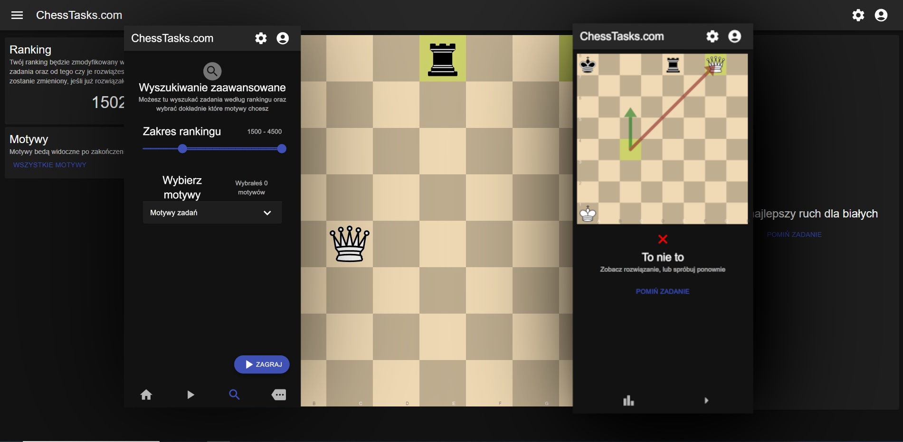

# ChessTasks.com
 Cross-Platform Application
<br>
I wrote with ❤ in React and MUI components.

[](https://github.com/kacperfaber/chesstasks-app/actions/workflows/build.yml)
[](https://github.com/kacperfaber/chesstasks-app/actions/workflows/publish-web-app.yml)





## Versions

| **#**            |    DATE    | TYPE |
|------------------|:----------:|------|
| **1.0.0-beta.1** | 05.09.2023 | beta |


## Installation

#### App to run properly requires the API connection.
[See Api Repository](https://www.github.com/kacperfaber/chesstasks-server)

#### First clone the project
This command will clone the entire git repository, and will change current working directory to app.
```bash
git clone https://www.github.com/kacperfaber/chesstasks-app && cd chesstasks-app
```

#### Install dependencies
```bash
npm install
```


#### Modify run options
Fill the const 'config' with your API url and set the **API-KEY**.
```bash
# Edit 'config' const to set configuration properties.
vim webpack.config.dev.js

# Run compilation with configuration properties
npx webpack --config webpack.config.dev.js --env apiKey= --env apiUrl=
```

#### Run the app in developer mode
Will compile the code, and will host the app with serve.
```bash
# Will run compile and serve to localhost.
# Will be used configuration properties from webpack.config.dev.js
npm run run-dev
```

## Configuration
```json5
{
  "apiUrl": "URL where API server is running.",
  "apiKey": "Security key"
}
```


## Author

Kacper Faber
